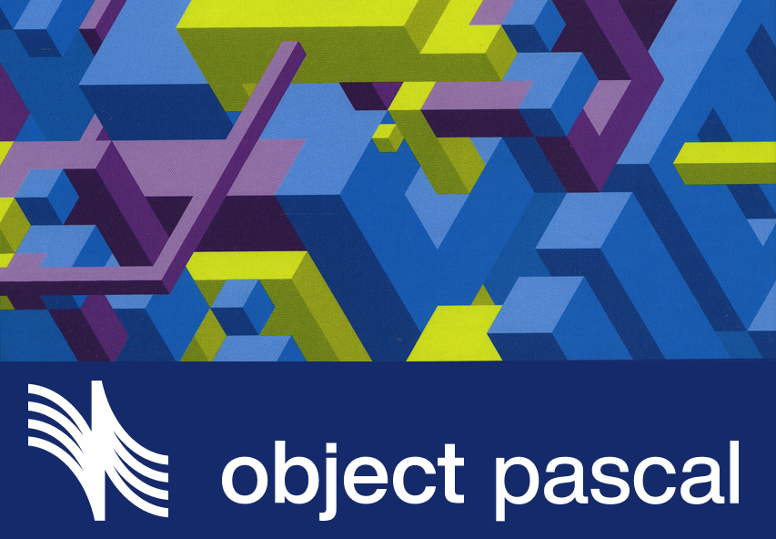

  

<h1 align="center">Адаптивный код для Object Pascal</h1>

  Адаптация материалов книги для языка программирования Object Pascal и его свободной реализации FreePascal.

 

## Описание

Этот репозиторий создан для ведения записей по ходу изучения книги "Адаптивный код. Гибкое кодирование с помощью паттернов проектирования и принципов SOLID. 2-е издание" от Гэри Маклина Холла.

Материал адаптируется под разработку на Lazarus и компиляторе FreePascal. В качестве языка программирования используется ObjectPascal.

Содержание:
- Глава 1. Введение в Srum
- Глава 2. Введение в Канбан
- [Глава 3. Зависимости и разделение на уровни](./chapter3/README.md)

## Лицензирование

### Исходный код

Весь код в репозитории предоставляется под лицензией MIT, чтобы вы могли использовать его без всяких обременений.

### Логотип

В качестве логотоипа Object Pascal используется адаптированная версия оригинального логотипа от OttoCoddo, который доступен по лицензии Creative Commons Attribution-ShareAlike 4.0 International License (CC BY-SA 4.0). Оригинальный материал доступен по ссылке: https://github.com/ObjectPascal-Community/UnofficialObjectPascalLogos?tab=readme-ov-file#o.