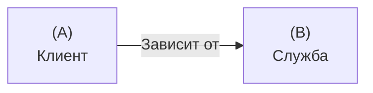
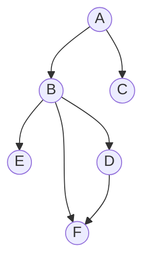
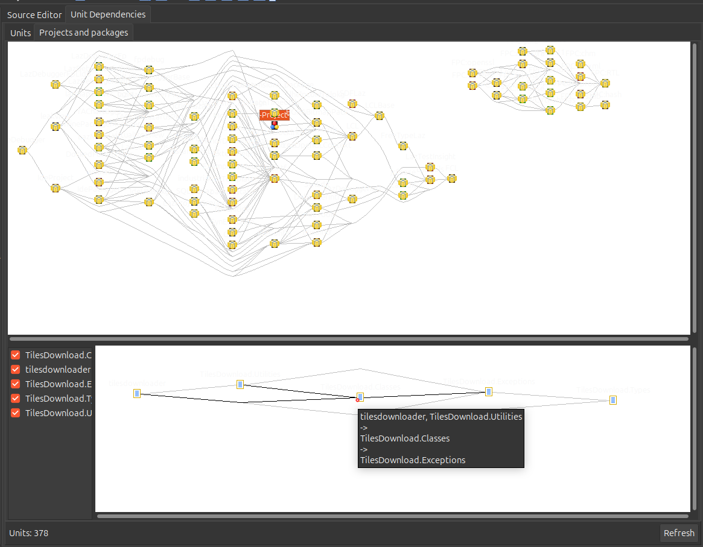

# Глава 3. Зависимости и разделение на уровни.

## Зависимости

Зависимость - это отношение между двумя сущностями. Оно состоит из *Клиента* и *Службы*. Клиент всегда зависит от службы.

### Зависимость от инфраструктуры

В качестве инфраструктуры у нас выступают *Lazarus* и компилятор *FreePascal*, через который *Lazarus* компилирует наш проект.

### Сторонние зависимости

К сторонним зависимостям относятся сборки других разработчиков. Ими могут быть пакеты в *Lazarus*, или модули, добавленные в проект.

Пример сторонней зависимости в виде пакета *BGRABitmapPack*:

 

### Моделирование зависимостей

Для моделирования зависимостей лучше всего подходят *ориентированные графы*.

Пример *ориентированного графа*:

#### Просмотр зависимостей

В *Lazarus* используется *View -> Unit Dependencies*.

## Управление зависимостями

## Разделение на уровни

## Заключение