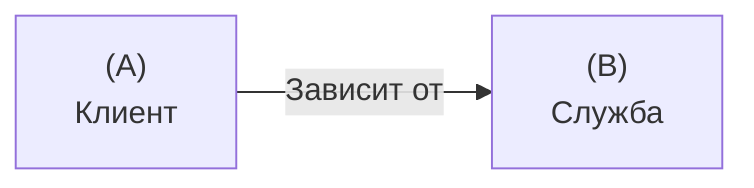
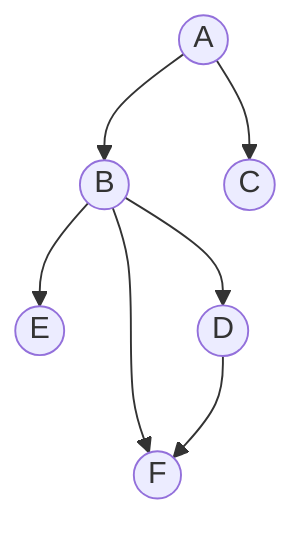
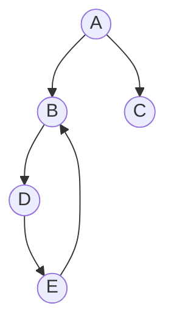
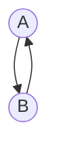
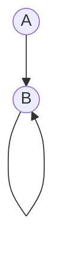

# Глава 3. Зависимости и разделение на уровни.

## Зависимости

Зависимость - это отношение между двумя сущностями. Оно состоит из *Клиента* и *Службы*. Клиент всегда зависит от службы.



### Зависимость от инфраструктуры

В качестве инфраструктуры у нас выступают *Lazarus* и компилятор *FreePascal*, через который *Lazarus* компилирует наш проект.

### Сторонние зависимости

К сторонним зависимостям относятся сборки других разработчиков. Ими могут быть пакеты в *Lazarus*, или модули, добавленные в проект.

Пример сторонней зависимости в виде пакета *BGRABitmapPack*:

 

### Моделирование зависимостей

#### Моделирование зависимостей в ориентированном графе

Для моделирования зависимостей лучше всего подходят *ориентированные графы*.

Пример *ориентированного графа*:


#### Циклические зависимости

Предыдущий граф является *ациклическим*, т.к. он не имеет циклов. Но существуют так же и *цилкические* графы, в которых можно начать и вернуться в один и тот же узел.

Пример *циклического орграфа*:


Так делать **нельзя**. Это называется *циклической зависимостью*, иногда называемой *круговой заисимостью*. В таком случае узел ``D`` зависит *сам от себя*, чего быть **не должно**.

Для примера возьмём два модуля, которые буду зависить друг от друга.

Модуль A:

```Pascal
unit A;

{$mode ObjFPC}{$H+}

interface

uses
  Classes, SysUtils, B;

implementation

end.    
```

Модуль B:

```Pascal
unit B;

{$mode ObjFPC}{$H+}

interface

uses
  Classes, SysUtils, A;

implementation

end.  
```

Зависимость между ними выглядит вот так:



Компилятор Free Pascal не даст вам сделать циклическую зависимость, выдав ошибку:

```
a.pas(8,23) Error: Circular unit reference between A and B
```

Однако есть *уловка*, позволяющая модулям использовать друг друга. Для этого достаточно в одном из модулей переместить второй модуль в ``uses`` из раздела ``interface`` в раздел ``implementation``:

Модуль А:

```Pascal
unit A;

{$mode ObjFPC}{$H+}

interface

uses
  Classes, SysUtils;

implementation

uses
  B;

end.        
```

Модуль ``B`` осталься таким же. Но это **плохой пример**, который использоваться не стоит.

#### Петли

*Петли* являются специализациями циклов в орграфах. Если узел соединяется с помощью ребра с *самим собой*, тогда ребро становится петлёй.

На практике сборки всегда явно зависят от себя. и такое наблюдение не заслуживает особого внимания. Однако на уровне методов и функций петля свидетельствует о *рекурсии*:

```Pascal
interface

type

  TRecursionLoop = class
  public
    procedure A;
    function B(ANumber: Integer): Integer
  end;
  
implementation

  procedure TRecursionLoop.A;
  var 
    x: Integer = 6;
  begin
    WriteLn(Format('%d <> %d', [x, B(x)]));
  end;
  
  function TRecursionLoop.B(ANumber: Integer): Integer;
  begin
    if ANumber = 0 then 
      Exit(1)
    else
      Exit(ANumber * B(ANumber - 1));
  end;
```

Их зависимость выглядит так:



#### Просмотр зависимостей

В *Lazarus* используется *View -> Unit Dependencies*.


## Управление зависимостями


## Разделение на уровни


## Заключение